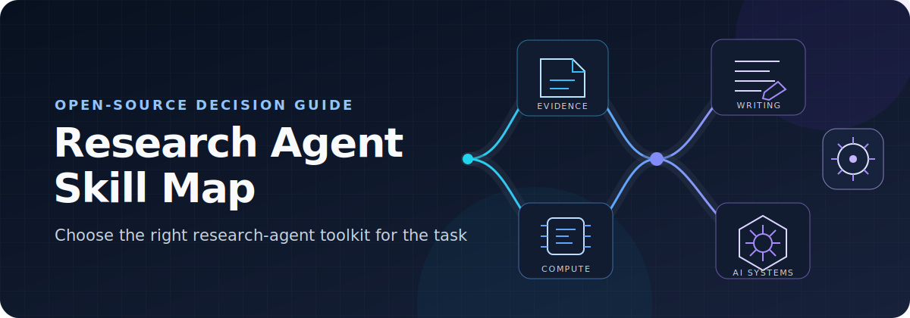
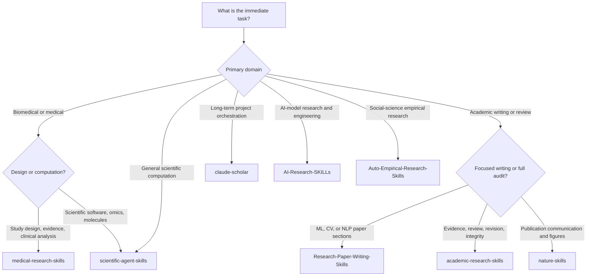

  

<h1 align="center">Research Agent Skill Map</h1>

<strong>A practical guide to choosing open-source agent skill libraries for scientific research, academic writing, and AI engineering.</strong>

  
  
  
  

  <a href="#quick-selector">Quick Selector</a> ·
  <a href="#decision-tree">Decision Tree</a> ·
  <a href="#comparison-matrix">Comparison Matrix</a> ·
  <a href="#repository-profiles">Repository Profiles</a> ·
  <a href="#recommended-combinations">Recommended Combinations</a> ·
  <a href="#selection-principles">Selection Principles</a> ·
  <a href="#safety-and-verification">Safety and Verification</a> ·
  <a href="#sources-and-update-policy">Sources</a> ·
  <a href="#contributing">Contributing</a>

This guide compares eight open-source agent-skill ecosystems that overlap in useful ways but solve different problems. It is intended for researchers, research engineers, reviewers, and technical writers who need a clear starting point without treating every skill library as interchangeable.

Choose by research domain, current project stage, and immediate task. A biomedical study-design toolkit, a scientific-computing library, a manuscript-audit workflow, and an AI-model engineering collection may all be valuable, but they are not substitutes for one another.

> **Independent guide:** This project is not affiliated with, maintained by, or endorsed by any repository listed here. Descriptions summarize public upstream documentation and do not constitute a quality certification.

## Quick Selector

| Task | Start with | Add when needed |
|---|---|---|
| Biomedical study design | [medical-research-skills](https://github.com/aipoch/medical-research-skills) | [academic-research-skills](https://github.com/Imbad0202/academic-research-skills) for integrity gates and structured review |
| Biomedical literature synthesis | [medical-research-skills](https://github.com/aipoch/medical-research-skills) | [nature-skills](https://github.com/Yuan1z0825/nature-skills) for source-aligned reading and publication communication |
| Bioinformatics and scientific computation | [scientific-agent-skills](https://github.com/K-Dense-AI/scientific-agent-skills) | [medical-research-skills](https://github.com/aipoch/medical-research-skills) when medical study logic is central |
| Protein or molecular modeling | [scientific-agent-skills](https://github.com/K-Dense-AI/scientific-agent-skills) | A project-specific validation and reproducibility workflow |
| Manuscript integrity audit | [academic-research-skills](https://github.com/Imbad0202/academic-research-skills) | [nature-skills](https://github.com/Yuan1z0825/nature-skills) for references, figures, statistics, or reviewer response |
| Final scientific writing | [nature-skills](https://github.com/Yuan1z0825/nature-skills) | [academic-research-skills](https://github.com/Imbad0202/academic-research-skills) when evidence traceability needs a broader pipeline |
| ML-method paper writing | [Research-Paper-Writing-Skills](https://github.com/Master-cai/Research-Paper-Writing-Skills) | [academic-research-skills](https://github.com/Imbad0202/academic-research-skills) for multi-stage review and revision |
| Long-running research-project management | [claude-scholar](https://github.com/Galaxy-Dawn/claude-scholar) | A domain library for the analysis or writing task currently in progress |
| AI-model development | [AI-Research-SKILLs](https://github.com/Orchestra-Research/AI-Research-SKILLs) | [scientific-agent-skills](https://github.com/K-Dense-AI/scientific-agent-skills) for adjacent scientific data or domain tools |
| Social-science causal inference | [Auto-Empirical-Research-Skills](https://github.com/brycewang-stanford/Auto-Empirical-Research-Skills) | [academic-research-skills](https://github.com/Imbad0202/academic-research-skills) for final review and writing workflow |

## Decision Tree

The tree identifies a starting point, not a mandatory stack. Inspect individual skills, scripts, dependencies, and licenses before use.

## Comparison Matrix

| Repository | Primary focus | Best used for | Project stage | Technical depth | Key limitation |
|---|---|---|---|---|---|
| [medical-research-skills](https://github.com/aipoch/medical-research-skills) | Biomedical and medical research | Evidence synthesis, protocol design, clinical or omics analysis planning, scientific communication | Question to publication | Domain-specific, broad | Large collection; applicability and dependencies vary by skill |
| [Research-Paper-Writing-Skills](https://github.com/Master-cai/Research-Paper-Writing-Skills) | ML/CV/NLP paper writing | Drafting sections, improving argument flow, claim-evidence checks, self-review | Drafting and pre-submission | Writing-focused | One focused skill package, not an analysis or project-orchestration system |
| [Auto-Empirical-Research-Skills](https://github.com/brycewang-stanford/Auto-Empirical-Research-Skills) | Empirical social science and causal inference | Econometrics, reproducible empirical workflows, literature, writing, replication checks | Data to reproducible manuscript | Domain-specific, workflow-oriented | Broad vendored catalog; primarily aligned with empirical social science rather than molecular research |
| [academic-research-skills](https://github.com/Imbad0202/academic-research-skills) | End-to-end academic research integrity | Research, drafting, review, revision, citation and claim verification | Research to final review | Broad, orchestration-heavy | Full functionality is centered on Claude Code; Codex uses a sibling distribution |
| [nature-skills](https://github.com/Yuan1z0825/nature-skills) | Scientific communication and publication artifacts | Reading, writing, polishing, figures, statistics review, references, responses, presentations | Reading to publication | Publication-focused | Journal-style presentation and automated checks do not validate the underlying method |
| [scientific-agent-skills](https://github.com/K-Dense-AI/scientific-agent-skills) | Multidisciplinary scientific computing | Bioinformatics, chemistry, protein work, scientific databases, analysis, visualization | Analysis and technical execution | Broad, technically deep | Breadth makes selective installation and dependency review important |
| [claude-scholar](https://github.com/Galaxy-Dawn/claude-scholar) | Research-project and software workflow | Literature, coding, experiments, reporting, writing, and persistent project knowledge | Whole project lifecycle | Workflow- and integration-oriented | Most aligned with software-heavy CS/AI research; installation changes agent configuration |
| [AI-Research-SKILLs](https://github.com/Orchestra-Research/AI-Research-SKILLs) | AI-model research and engineering | Architectures, training, post-training, evaluation, inference, MLOps, agents, RAG | Idea to deployment and paper | Engineering-focused | Specialized for research on AI systems, not general domain-science methodology |

## Repository Profiles

<strong><a href="https://github.com/aipoch/medical-research-skills">aipoch/medical-research-skills</a></strong> — biomedical research logic across the study lifecycle

- **Positioning:** A large medical and biomedical skill library organized around evidence, protocol design, data analysis, academic writing, and related research operations.
- **Primary scope:** Literature appraisal, study design, clinical and translational analysis, bioinformatics, meta-analysis, drug discovery, visualization, and manuscript preparation.
- **Use it when:** The task depends on medical study types, clinical evidence standards, biomedical terminology, or disease- and modality-aware analysis planning.
- **Less suitable when:** The main task is AI infrastructure engineering or a domain-neutral writing edit with no biomedical reasoning.
- **Strongest differentiator:** Medical-research logic is explicit rather than incidental to a general computing library.
- **Typical users:** Biomedical researchers, clinical research teams, evidence-synthesis practitioners, and computational biologists.
- **Closest comparison:** It overlaps with scientific-agent-skills on omics, statistics, and scientific tools, but centers medical questions, protocols, and evidence pathways.

<strong><a href="https://github.com/K-Dense-AI/scientific-agent-skills">K-Dense-AI/scientific-agent-skills</a></strong> — multidisciplinary scientific computation and databases

- **Positioning:** A broad library of executable scientific workflows, package guidance, and database access across biology, chemistry, medicine, physics, engineering, geospatial work, and scientific communication.
- **Primary scope:** Bioinformatics, cheminformatics, molecular and protein workflows, imaging, machine learning, statistics, simulation, visualization, laboratory automation, and scientific data sources.
- **Use it when:** The work requires technical depth in scientific Python/R tooling, specialized databases, or a multi-step computational workflow.
- **Less suitable when:** The primary need is a tightly governed manuscript revision process or discipline-specific causal inference.
- **Strongest differentiator:** Breadth across scientific software ecosystems and data resources.
- **Typical users:** Computational scientists, bioinformaticians, research engineers, and multidisciplinary technical teams.
- **Closest comparison:** It overlaps with medical-research-skills in biomedicine, but extends much further into general science and engineering while providing less medical-specific study logic.

<strong><a href="https://github.com/Imbad0202/academic-research-skills">Imbad0202/academic-research-skills</a></strong> — evidence-aware academic workflow and integrity gates

- **Positioning:** A human-in-the-loop research, writing, review, revision, and finalization system with explicit attention to claim support and integrity.
- **Primary scope:** Deep research, paper planning and drafting, multi-perspective review, revision, citation verification, consistency checks, and staged quality gates.
- **Use it when:** A manuscript or review needs traceable evidence, structured checkpoints, reproducibility metadata, and deliberate revision rather than surface polishing alone.
- **Less suitable when:** A single short editing task does not justify a broad orchestrated pipeline, or the host platform cannot support its full Claude Code machinery.
- **Strongest differentiator:** Research and manuscript quality are treated as a gated workflow, not only a prose-generation task.
- **Typical users:** Academic authors, reviewers, systematic-review teams, and researchers preparing submission packages.
- **Closest comparison:** It overlaps with nature-skills on writing and review, but emphasizes end-to-end evidence and integrity; nature-skills is more directly oriented to publication artifacts and communication.

<strong><a href="https://github.com/Yuan1z0825/nature-skills">Yuan1z0825/nature-skills</a></strong> — scientific communication and publication artifacts

- **Positioning:** A collection for source-aligned reading, manuscript writing and polishing, figures, statistical reporting checks, references, reviewer responses, presentations, and related publication outputs.
- **Primary scope:** Paper reading, literature search, drafting, language refinement, figure production, reference verification, data-availability planning, peer-review simulation, revision responses, and paper-to-slides workflows.
- **Use it when:** The immediate deliverable is a readable paper analysis, manuscript section, publication figure, reference audit, response letter, or scientific presentation.
- **Less suitable when:** The core problem is experimental design, raw omics processing, or model-training infrastructure.
- **Strongest differentiator:** A coherent set of communication-oriented skills that produce concrete publication artifacts.
- **Typical users:** Scientific authors, reviewers, journal-club presenters, and teams preparing manuscripts or revisions.
- **Closest comparison:** It overlaps with academic-research-skills on writing and review, but is more artifact- and presentation-oriented. Journal-style output still requires independent methodological validation.

<strong><a href="https://github.com/Master-cai/Research-Paper-Writing-Skills">Master-cai/Research-Paper-Writing-Skills</a></strong> — focused ML, CV, and NLP paper writing

- **Positioning:** A compact skill package for drafting and revising machine-learning research papers.
- **Primary scope:** Abstract, introduction, methods, experiments, and conclusion writing; paragraph flow; claim-evidence alignment; reviewer-style self-checks.
- **Use it when:** A technical ML/CV/NLP manuscript needs focused section-level writing guidance without a large surrounding system.
- **Less suitable when:** The task requires biomedical design, data analysis, literature infrastructure, or long-running project memory.
- **Strongest differentiator:** Narrow scope and low conceptual overhead for ML-paper writing.
- **Typical users:** Machine-learning researchers, computer-vision authors, NLP authors, and research engineers preparing papers.
- **Closest comparison:** It is narrower than both academic-research-skills and AI-Research-SKILLs: the former adds integrity orchestration, while the latter adds model-development engineering.

<strong><a href="https://github.com/Galaxy-Dawn/claude-scholar">Galaxy-Dawn/claude-scholar</a></strong> — project continuity across research and software development

- **Positioning:** A semi-automated research assistant for software-heavy academic projects, spanning ideation, literature, implementation, experiments, analysis, reporting, writing, and project knowledge.
- **Primary scope:** Research workflows, coding conventions, experiment tracking, Zotero and Obsidian integrations, reporting, figures and tables, manuscript work, and persistent file-based planning.
- **Use it when:** A long-running project needs an outer workflow layer that preserves decisions, evidence, experiment history, and next actions.
- **Less suitable when:** Only one domain-specific analysis or manuscript edit is needed, or configuration-level installation is undesirable.
- **Strongest differentiator:** Project continuity connects research reasoning with software execution and knowledge management.
- **Typical users:** CS/AI researchers, research engineers, and computational projects with repeated coding and experiment cycles.
- **Closest comparison:** It overlaps with academic-research-skills in research and writing, but places more weight on ongoing software work, experiment memory, and integrated project operations.

<strong><a href="https://github.com/Orchestra-Research/AI-Research-SKILLs">Orchestra-Research/AI-Research-SKILLs</a></strong> — AI research engineering from architecture to serving

- **Positioning:** A specialized library for researching and engineering AI models, with both orchestration and framework-specific technical skills.
- **Primary scope:** Model architecture, tokenization, fine-tuning, post-training, interpretability, data processing, safety, distributed training, optimization, evaluation, inference, MLOps, agents, RAG, multimodal systems, and ML paper writing.
- **Use it when:** The research object is an AI model or AI system and the work involves implementation, training, evaluation, deployment, or infrastructure.
- **Less suitable when:** AI is merely a tool inside a biomedical, chemical, or social-science study whose methodology is the central concern.
- **Strongest differentiator:** Deep coverage of the modern AI development stack alongside research ideation and paper workflows.
- **Typical users:** AI researchers, ML engineers, systems researchers, and teams evaluating or deploying models.
- **Closest comparison:** It overlaps with scientific-agent-skills on machine learning, but focuses on AI-model research itself rather than scientific-domain computation.

<strong><a href="https://github.com/brycewang-stanford/Auto-Empirical-Research-Skills">brycewang-stanford/Auto-Empirical-Research-Skills</a></strong> — empirical social science and causal inference

- **Positioning:** A router and curated, vendored collection for empirical research, with flagship Python, R, and Stata workflows and extensive causal-inference coverage.
- **Primary scope:** Data cleaning, econometrics, difference-in-differences, instrumental variables, regression discontinuity, synthetic controls, literature, reproducible manuscripts, citation checks, peer review, and replication audits.
- **Use it when:** The study is empirical social science and causal identification, statistical specification, or reproducible analysis is central.
- **Less suitable when:** The task is molecular biology, omics, protein modeling, or laboratory protocol design.
- **Strongest differentiator:** Method- and software-aware causal workflows combined with a large routed empirical-research catalog.
- **Typical users:** Economists, political scientists, sociologists, education researchers, public-policy analysts, and other quantitative social scientists.
- **Closest comparison:** It overlaps with broad academic and scientific libraries on writing and statistics, but its organizing logic is empirical social-science methodology and causal inference.

## Recommended Combinations

These patterns are optional handoffs. Install only the skills needed for the current step, and define which library governs each task.

### Biomedical research workflow

[medical-research-skills](https://github.com/aipoch/medical-research-skills) for biomedical design and evidence 
→ [scientific-agent-skills](https://github.com/K-Dense-AI/scientific-agent-skills) for technical computation 
→ [academic-research-skills](https://github.com/Imbad0202/academic-research-skills) for integrity and review 
→ [nature-skills](https://github.com/Yuan1z0825/nature-skills) for publication communication

### Computational-method paper

[scientific-agent-skills](https://github.com/K-Dense-AI/scientific-agent-skills) for computation 
→ [Research-Paper-Writing-Skills](https://github.com/Master-cai/Research-Paper-Writing-Skills) for focused ML-method writing 
→ [academic-research-skills](https://github.com/Imbad0202/academic-research-skills) for structured review

### AI research project

[scientific-agent-skills](https://github.com/K-Dense-AI/scientific-agent-skills) for general scientific tools 
→ [AI-Research-SKILLs](https://github.com/Orchestra-Research/AI-Research-SKILLs) for model engineering 
→ [Research-Paper-Writing-Skills](https://github.com/Master-cai/Research-Paper-Writing-Skills) for the paper draft 
→ [academic-research-skills](https://github.com/Imbad0202/academic-research-skills) for review and integrity

### Long-running research program

Use [claude-scholar](https://github.com/Galaxy-Dawn/claude-scholar) as the outer project-orchestration layer. Select medical-research-skills, scientific-agent-skills, AI-Research-SKILLs, or a writing library only for the individual task being executed.

### Empirical social-science study

[Auto-Empirical-Research-Skills](https://github.com/brycewang-stanford/Auto-Empirical-Research-Skills) for design, analysis, and reproducibility 
→ [academic-research-skills](https://github.com/Imbad0202/academic-research-skills) for review and final writing workflow

## Selection Principles

> **Use the smallest set of skills that adequately covers the current task.**

Evaluate each candidate along these dimensions:

- **Research domain:** Prefer domain logic that matches the evidence, data, and methods in use.
- **Immediate task:** Select a skill for the next concrete deliverable, not for every possible future need.
- **Project stage:** Study design, analysis, drafting, review, and publication require different controls.
- **Software ecosystem:** Check host-agent compatibility, operating-system assumptions, languages, databases, and command-line tools.
- **Automation level:** Decide which actions may run automatically and which require an explicit human checkpoint.
- **Source verification:** Determine whether the workflow records source locators and checks that citations support the associated claims.
- **Reproducibility:** Preserve inputs, code, versions, parameters, environments, and generated artifacts when results matter.
- **Overlap and conflicts:** Multiple broad orchestration systems can issue competing instructions. Assign one governing workflow per task and use narrower libraries as scoped tools.
- **Maintenance status:** Review releases, recent commits, issue activity, and current installation documentation.
- **License and dependencies:** Read the license for every upstream project and for any bundled or vendored material; inspect package and service requirements before installation.

## Safety and Verification

Agent skills are instructions plus, in some repositories, scripts and integrations. Treat installation as a code review boundary:

- Inspect each `SKILL.md`, referenced script, hook, installer, and configuration change before enabling it.
- Understand requested file, shell, network, credential, and package-installation permissions.
- Do not provide credentials, confidential documents, or private research data unless the environment and workflow are approved for them.
- Use isolated environments or disposable worktrees where a skill runs unfamiliar code or adds dependencies.
- Preserve version control, analysis logs, environment details, and a record of automated changes.
- Verify citations, calculations, figures, statistical choices, and scientific claims independently.
- Check each upstream repository's license, including licenses for vendored skills and dependencies.
- Re-check upstream documentation before use; features, installation steps, activity, and risk profiles can change.

## Sources and Update Policy

**Last reviewed:** 2026-07-21

The profiles above summarize the public README, repository structure, and visible metadata of these upstream projects:

- [aipoch/medical-research-skills](https://github.com/aipoch/medical-research-skills)
- [Master-cai/Research-Paper-Writing-Skills](https://github.com/Master-cai/Research-Paper-Writing-Skills)
- [brycewang-stanford/Auto-Empirical-Research-Skills](https://github.com/brycewang-stanford/Auto-Empirical-Research-Skills)
- [Imbad0202/academic-research-skills](https://github.com/Imbad0202/academic-research-skills)
- [Yuan1z0825/nature-skills](https://github.com/Yuan1z0825/nature-skills)
- [K-Dense-AI/scientific-agent-skills](https://github.com/K-Dense-AI/scientific-agent-skills)
- [Galaxy-Dawn/claude-scholar](https://github.com/Galaxy-Dawn/claude-scholar)
- [Orchestra-Research/AI-Research-SKILLs](https://github.com/Orchestra-Research/AI-Research-SKILLs)

The structured registry in [`data/repositories.yml`](data/repositories.yml) records the same review date and concise maintenance fields. Upstream maintainers retain ownership of their projects, names, and trademarks. Each repository has its own license and dependency terms. This guide can become outdated as projects evolve; corrections are welcome.

## Contributing

Use the Issues tab to open the [repository suggestion form](.github/ISSUE_TEMPLATE/repository-suggestion.yml), or report an inaccurate or outdated description with the [correction form](.github/ISSUE_TEMPLATE/correction.yml). Comparison improvements may also be submitted as focused pull requests.

Please support factual changes with links to current upstream documentation. See [`CONTRIBUTING.md`](CONTRIBUTING.md) for the lightweight review criteria.
